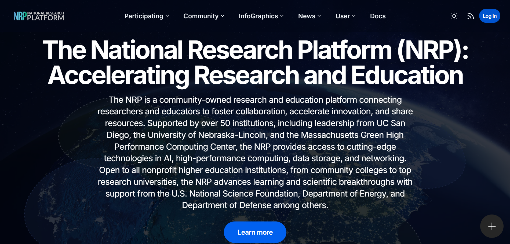
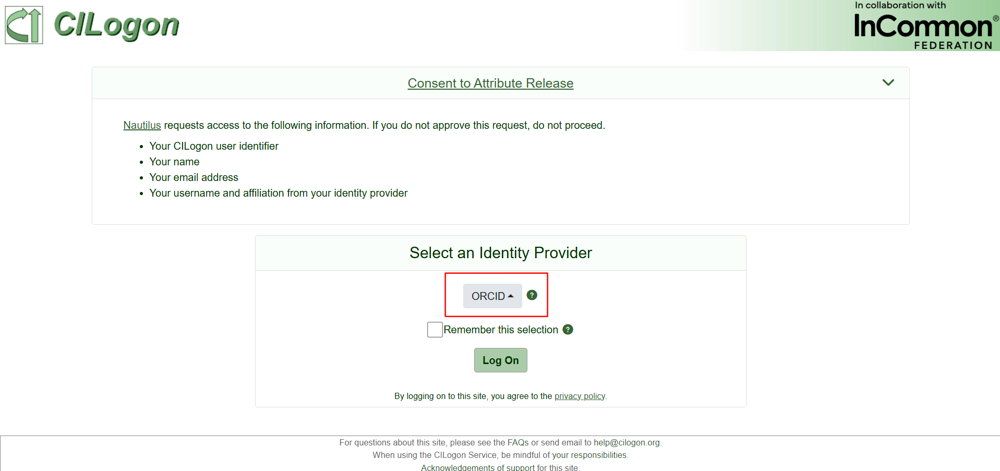
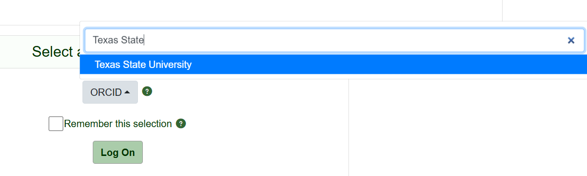
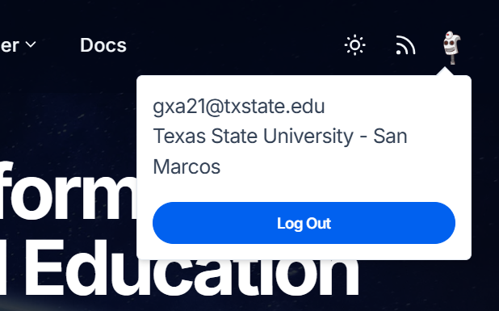

Accessing NRP 
=============

Nautilus is another resource available through NSF ACCESS that allows Texas State University faculty and staff to utilize its resources! The documentation can be found here:
https://nrp.ai/documentation/userdocs/start/getting-started/

  But a specific walkthrough can be found below:

1. Login to NRP Portal 

https://nrp.ai/

When you attempt to sign in, you will be redirected to their authentication system through CI Logon. The default log on is Orcid, but **if you are a Texas State student, researcher, or faculty,** select this dropdown and type in 'Texas State University' instead:

You will then be brought to the Texas State University authentication portal. Sign in with your Texas State credentials.

It will then redirect you to the **NRP Acceptable Use policy**. Click 'agree' and continue.

Once you return to the homepage, you should now see that you have an account in the top right:

2. Create Matrix account 

Documentation found here: https://matrix.org

Follow the guidance for the web client. 

If you are doing the app make sure you change the server name: 

https://matrix.nrp-nautilus.io 

3. Request admin access for namespace 

  Go to the NRP Support Channel and request admin access for namespace
  "I would like to request admin access to create a namespace for my research group at TXST" 
