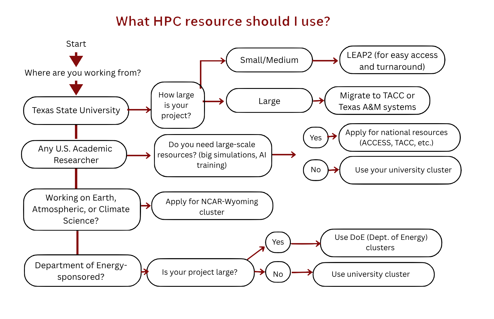

What Compute do I need?
===================

How do you determine what your compute needs are?

Follow the flowchart below to determine what system your project will require:

Project Size
============

How big is your workload?

  ├── Small (hours–days runtime, moderate data)
  │       → University clusters (LEAP2, Texas A&M)
  │
  ├── Medium (days–weeks, GPUs, larger datasets)
  │       → TACC systems or ACCESS/NRP
  │
  └── Massive (weeks–months, extreme scale)
          → DOE Labs (INCITE/ALCC programs)

**Quick-Decision Rule of Thumbs:**
• Just starting / learning HPC  
  → LEAP2 or Texas A&M clusters  

• Need more GPUs or scale  
  → TACC or ACCESS  

• Doing distributed / cloud-native workflows  
  → NRP (Kubernetes-based HPC) :contentReference[oaicite:0]{index=0}  

• Climate / weather / Earth science  
  → NCAR-Wyoming systems (specialized datasets + models) :contentReference[oaicite:1]{index=1}  

• Massive, cutting-edge science (top 1%)  
  → DOE Labs (leadership-class supercomputers) :contentReference[oaicite:2]{index=2}  

• Need instant, scalable resources  
  → Cloud HPC (AWS, Cirrascale)  
