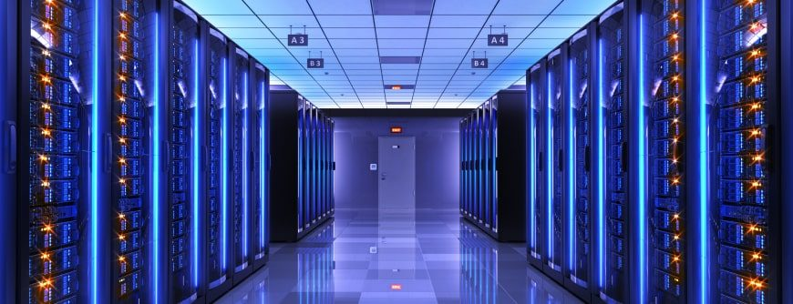

HPC Resources -- Why HPC?
=========================

Utilizing HPC in your research can greatly accelerate it. Not only do HPC systems allow you to 
work with larger amounts of data, but they can also accelerate the process of making sense of 
it by providing more powerful computers. HPC systems expand the limits of what is possible with 
your research by allowing for more detailed simulations, more accurate models, and lightning-fast 
compute times. Instead of shrinking models to suit desktop workstations, HPC systems allow you to 
submit vast amounts of training data to a more capable machine.

Problems that could take weeks can often be reduced to hours, enabling tighter feedback loops, 
faster iteration, and more ambitious experimental design. HPC systems provide access to thousands 
of CPU cores, GPU accelerators, high-memory nodes, and ultra-fast interconnects designed specifically 
for large-scale computation. This means you can parallelize simulations, distribute workloads 
efficiently, and run ensemble experiments. Rather than settling for a single model run, you 
can execute hundreds of variations to test robustness.

**AI Workloads**
HPC systems are particularly well-suited for AI workloads, which often require massive parallel 
computation, high-throughput data pipelines, and specialized hardware like GPUs and tensor accelerators. 
Training modern machine learning models—especially deep neural networks—involves performing billions 
to trillions of mathematical operations across large datasets. On a standard workstation, this process
is often prohibitively slow or outright infeasible. 

HPC environments, however, are explicitly designed to distribute these computations across many nodes 
and accelerators simultaneously, dramatically reducing training time. With HPC, you can analyze larger sets
of data and train more complex models for your research, leading to new and more significant insights.
 
Instead of subsampling your dataset, you can analyze it in full. That shift, from "what can my laptop 
handle?" to "what does the science require?", is extremely transformative in research--probably why 
`every Department of Energy lab to date utilizes them! <https://www.energy.gov/supercomputing-and-exascale>`_

