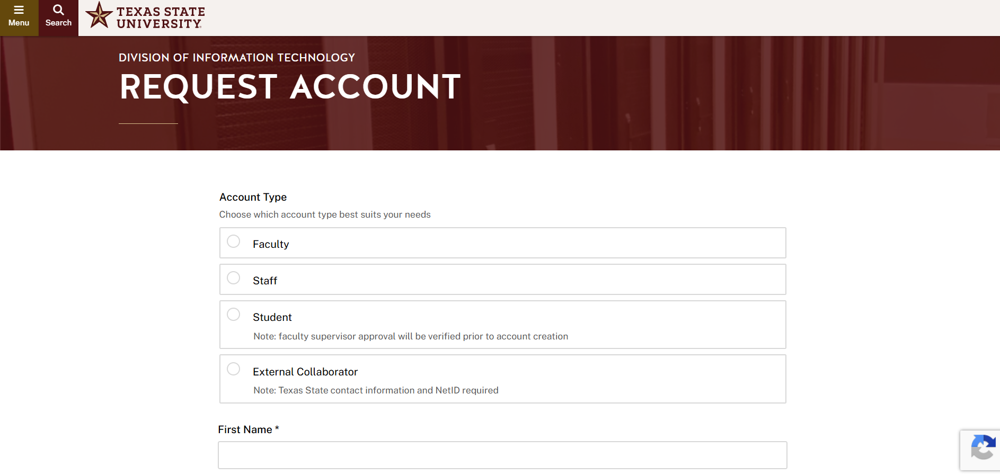
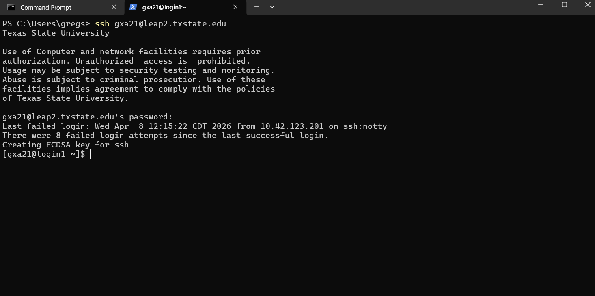
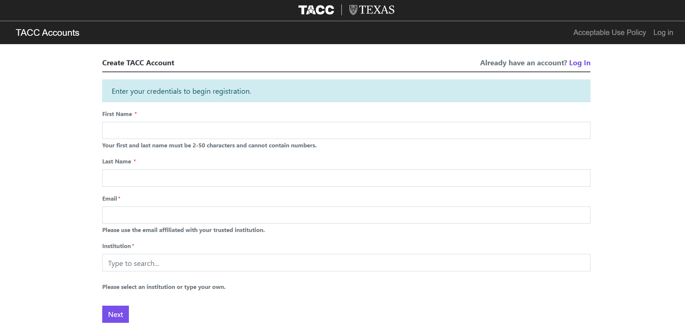

Local
=====

`Texas State Cluster: LEAP2 <https://doit.txst.edu/hpc.html>`_
--------------------------------------------------------------

Texas State University has its own HPC cluster available to Texas State researchers called LEAP2. With 5,808 total CPU cores, 8 NVIDIA A100 GPU nodes, and 100 GB/s, it is a respectable HPC system capable of rigorous scientific workloads. Any student or faculty member can request allocation space through the LEAP2 portal here , though it is also open to requests for external collaborators. Documentation for using the LEAP2 cluster can be found here . It utilizes a SLURM scheduler and is Linux-based. 

**Access instructions:**
Not every student at Texas State is going to have access to to the LEAP2 cluster, but if you are a student or researcher in need of HPC resources, you can request an account.

Go to: https://doit.txst.edu/hpc.html and scroll to the bottom of the page. Click on the "Request an Account" button:

.. image:: _static/leap2/1.png
   :width: 600px
   :align: center

First, it will ask you to **sign in with your Texas State credentials**. After signing in, you will be brought to a form:

Fill out the form and submit it. Keep in mind that you will need to have a research advisor or faculty supervisor if you are still a student.

Once an account has been created, you will receive an e-mail from **Shane Flaherty** with instructions on how to access the cluster.

You can access the cluster through a terminal using SSH on Texas State Wifi (TXST-Bobcats or TXST-Guest), or off-campus as long as you have our VPN: https://services.txst.edu/TDClient/39/ITAC/Requests/ServiceDet?ID=86

**Accessing LEAP2 via command line:**
You can SSH into LEAP2 using the following command:

``ssh [YOUR TX STATE USERNAME]@leap2.txst.edu``

You will then be prompted to enter your password. Once you have accessed the system, you will see this prompt:

You are now registered with LEAP2. For more information on the system, see the following documentation: https://itrcstats2.itrc.txstate.edu/wiki/index.php?title=Main_Page

`Texas Advanced Computing Center (TACC) <https://tacc.utexas.edu/>`_
--------------------------------------------------------------------

.. image:: _static/images/3.jpg
   :align: center

If you are looking for more powerful systems, the **Texas Advanced Computing Center**, located in Austin, TX also provides allocations for researchers who want to use HPC systems. Home to the `fastest supercomputer in the U.S. <https://tacc.utexas.edu/systems/frontera/>`_, TACC is a research unit of UT Austin, and it boasts extremely powerful systems: 

**Frontera**
 Compute Nodes: 8,368 nodes CPU: Intel Xeon Platinum 8280 ("Cascade Lake") Cores per Node: 56 cores Total CPU Cores: \~468,000+ Memory per Node: 192 GB DDR4 Interconnect: Mellanox HDR-100 InfiniBand Local Storage: 480 GB SSD/node 

**Lone Star 6** 
● Compute Nodes: 560 CPU nodes 
● GPU Nodes: 16 accelerator nodes CPU Nodes 
● Processor: 2× AMD EPYC 7763 (Milan) 
● Cores per Node: 128 cores 
● Memory: 256 GB DDR4/node 
● Clock Speed: 2.45 GHz GPU Nodes 
● GPUs: 2× NVIDIA A100 (40 GB HBM2) per node 

**Requesting an Account**
You need to be an authorized student or faculty memberof an educational or research insitution to use TACC systems.

If you meet these criteria, you can apply for an account here: https://accounts.tacc.utexas.edu/register

Other Texan HPC resources 
-------------------------
Like UT Austin, Texas A&M, UT Dallas, and the University of Houston have HPC clusters of varying size and scale. Although these university-specific clusters are typically only available to students and faculty of the university, they are often accessible through joint research grants, so if you are partnered with one of these institutions, it may be worth examining what resources you have access to.
