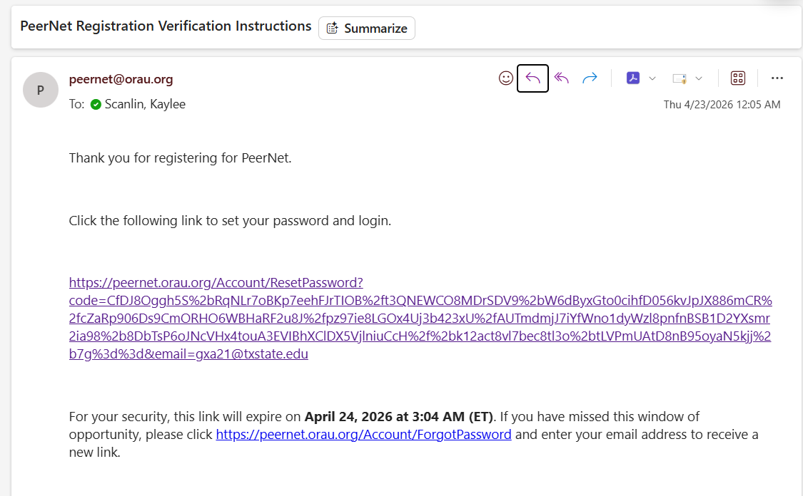
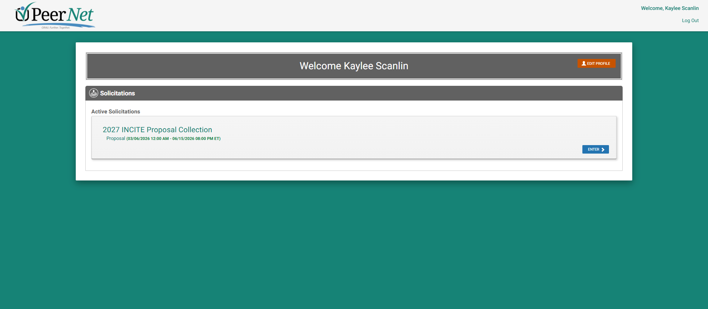

National Labs
=============

Many Department of Energy (DoE) labs offer free computing resources for researchers who submit proposals through their websites. Although access can be competitive, both academic and industry researchers can apply for accounts. 

DOE INCITE 
----------
Many national labs can be accessed specifically through **DoE INCITE**, a selective program dedicated to 
fostering innovation in research through HPC collaborations. Consider it an alternative route to 
ACCESS with a special focus in early-career PhD research: https://doeleadershipcomputing.org/ 

To determine whether the INCITE program is right for you, read the following documentation: https://doeleadershipcomputing.org/getting-started/

Using DOE INCITE:
-----------------
Navigate to: https://doeleadershipcomputing.org/

This will take you to the **PeerNet** dashboard, where you can view news, events, and other information related to INCITE.

**1.) In the upper right hand corner, click the blue 'Apply Now' button. You should be taken to this page:**

Click to create an account with PeerNet. **Ensure you use your Texas State e-mail.** For organization,
you can put "Texas State University".

**2.) Go to your e-mail and look for an e-mail from peernet@orau.org.**
This will contain instructions for verifying your account, and should look something like this:

Once you open the link, you will be asked to create a new password. **Reset it and log-in again.**

When you do, you will be taken to the PeerNet dashboard:

This will serve as an alert notice for INCITE-related activities.

Several DOE labs also offer opportunities to collaborate using their resources. Key DOE HPC user facilities include, from most to least accessible:
-------------------------------------------------------------------- 

**Open to researchers of all kinds:**

`Oak Ridge National Labs (OLCF) <https://www.olcf.ornl.gov/>`_
^^^^^^^^^^^^^^^^^^^^^^^^^^^^^^^^^^^^^^^^^^^^^^^^^^^^^^^^^^^^^^
Oak Ridge Leadership Computing Facility, operated at Oak Ridge National Laboratory, specializes in capability computing , where extremely large simulations are created using tens of thousands of nodes simultaneously. OLCF is one of the Department of Energy's flagship leadership-class supercomputing centers dedicated to open scientific research. OLCF hosts Frontier , the world's first operational exascale supercomputer capable of performing over one quintillion calculations per second, and is often lauded as one of the best supercomputing facilities in the United States. 

`Argonne (ALCF) <https://www.alcf.anl.gov/>`_
^^^^^^^^^^^^^^^^^^^^^^^^^^^^^^^^^^^^^^^^^^^^^^
The Argonne Leadership Computing Facility (ALCF) provides leadership-scale computing resources for open science at Argonne National Laboratory. Its flagship system, Aurora , is one of the world's first exascale supercomputers and supports massive simulations, AI training, and data-intensive scientific workflows. It is available worldwide, and specializes in HPC - AI integration. 

**Open to Researchers collaborating with the facility:**

`Lawrence Livermore National Laboratory <https://www.llnl.gov/>`_
^^^^^^^^^^^^^^^^^^^^^^^^^^^^^^^^^^^^^^^^^^^^^^^^^^^^^^^^^^^^^^^^^
Lawrence Livermore National Laboratory operates some of the most powerful simulation systems in the world, primarily supporting national security and advanced physics research. Its newest system, El Capitan , became the world's fastest supercomputer in 2024--2025 with exascale performance exceeding 1.8 exaflops.

 ● Although each DoE lab has incredible systems, LLNL is often hailed as the most advanced. 
 
`Lawrence-Berkely <https://www.llnl.gov/>`_
^^^^^^^^^^^^^^^^^^^^^^^^^^^^^^^^^^^^^^^^^^^^
The National Energy Research Scientific Computing Center (NERSC) is the primary production computing facility for the DOE Office of Science and supports over 11,000 researchers annually across universities and laboratories worldwide. Unlike leadership facilities focused on a few massive jobs, NERSC provides large-scale throughput computing for thousands of scientific projects simultaneously. 
It is designed for daily scientific computing rather than large-scale simulations. 

`Los Alamos National Laboratory <https://www.lanl.gov/>`_
^^^^^^^^^^^^^^^^^^^^^^^^^^^^^^^^^^^^^^^^^^^^^^^^^^^^^^^^^^
Los Alamos National Laboratory operates advanced HPC systems supporting national security, physics, energy, and computational science research. LANL has historically pioneered large-scale parallel computing and continues developing next-generation AI and simulation systems within DOE's exascale ecosystem. 

`Sandia National Laboratories <https://www.sandia.gov/>`_
^^^^^^^^^^^^^^^^^^^^^^^^^^^^^^^^^^^^^^^^^^^^^^^^^^^^^^^^^
Sandia National Laboratories develops advanced computing platforms supporting engineering, cybersecurity, and national security science. Sandia also hosts experimental computing platforms such as the QSCOUT quantum computing testbed, allowing researchers to explore emerging quantum-HPC workflows. 
It is an excellent choice for researchers interested in the HPC or quantum computing spaces. 

`National Energy Technology Laboratory <https://www.netl.doe.gov/>`_
^^^^^^^^^^^^^^^^^^^^^^^^^^^^^^^^^^^^^^^^^^^^^^^^^^^^^^^^^^^^^^^^^^^^
The National Energy Technology Laboratory supports computational research focused on energy systems, carbon capture, advanced manufacturing, and industrial simulation. However, it is worth noting that NETL operates HPC systems tailored toward applied energy research rather than leadership-scale capability computing.
