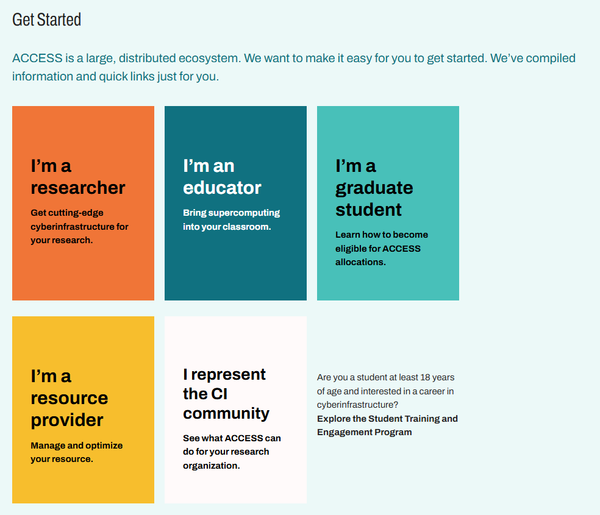
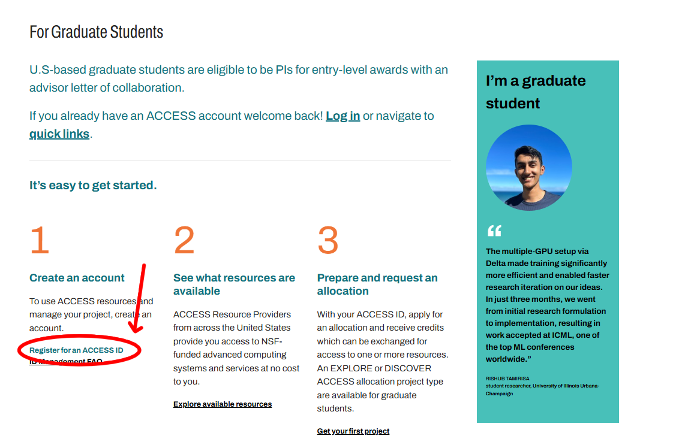
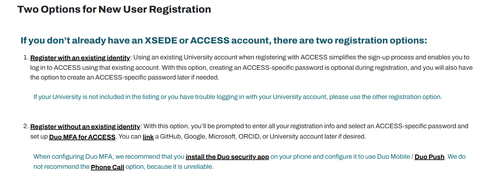
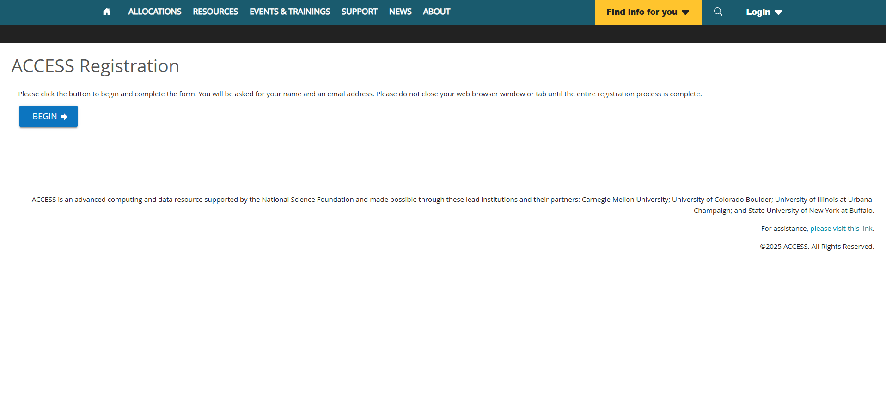
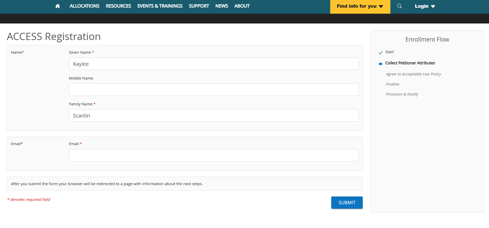
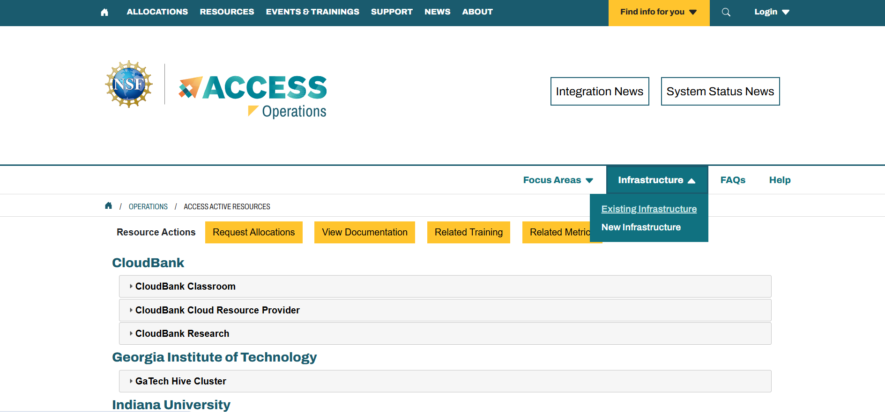
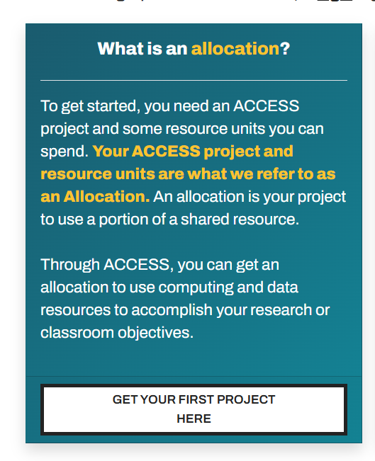
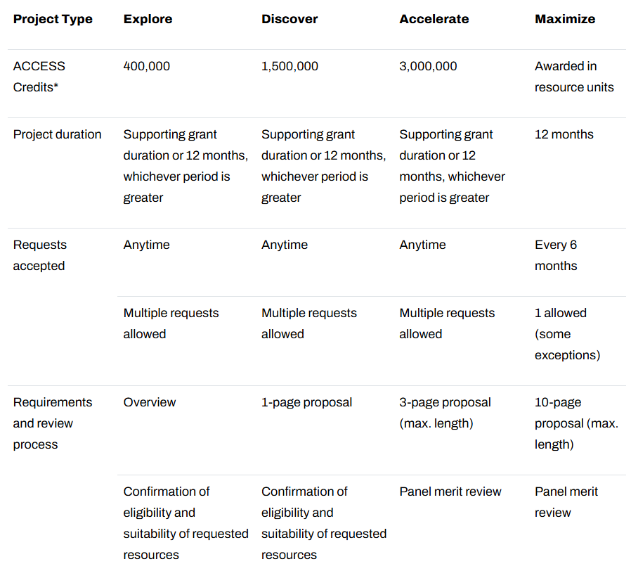
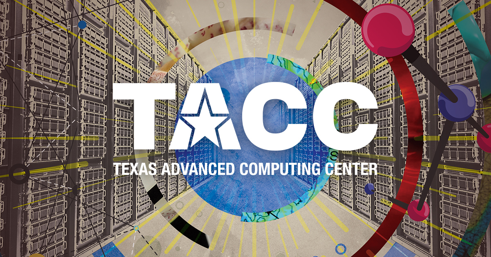

National Programs
=================

`NSF ACCESS <https://access-ci.org/>`_
--------------------------------------

The NSF ACCESS (Advanced Cyberinfrastructure Coordination Ecosystem: Services & Support) program is a U.S.
National Science Foundation initiative that provides academic researchers, educators, and students with 
coordinated access to advanced high-performance computing (HPC), cloud computing, storage, data resources, 
and technical expertise across multiple national computing centers. 

Rather than relying on a single supercomputer, ACCESS connects a nationwide ecosystem of systems through a unified allocation and user 
support framework. ACCESS is supported through your Texas State ID by default, but you must first create 
an account through your Texas State ID. 

Through ACCESS, you can explore **free HPC resources** across the U.S. and receive allocations depending 
on proposed projects of different computational complexity ('Explore', 'Discover', 'Accelerate', and 
'Maximize'.) ACCESS is the most comprehensive and useful tool available to researchers for finding 
HPC resources through the NSF. If you cannot find compute resources through LEAP2 or TACC, it is 
highly recommended you submit a project through ACCESS for compute allocations on different HPC 
systems. 

**Registering for an Account:**

**1.) Go to the ACCESS portal: https://access-ci.org/ and click "Get Started".**

**2.) Select appropriate access type.**

You should be taken to a screen where you can select your account type.
If you are a researcher affiliated with an institution at the non-student level,
select "Researcher". If you are a graduate student, press "Graduate Student."

Here we will select "Graduate Student" for demonstration purposes, but the process is similar for all.

**3.) Select 1. Create an account.**

Register for an ACCESS ID if you do not already have one. You should be brought to: https://operations.access-ci.org/identity/new-user

**4.) Click "2. Register without an existing identity."**

You should be taken to this page:

Click 'begin'.

**5.) Fill out form.**

You will be asked to fill out the following form:

Complete:
- Collect Petitioner Attributes
- Agree to Acceptable Use Policy
- Finalize
- Provision & Notify

**Ensure you use your Texas State e-mail address.**

**6.) Click 'Home' and then 'Infrastructure'.**

Once you get and verify your account, you should be able to click the **Infrastructure**
tab to find HPC resources available to you.

**7.) Click "Request Allocations" to apply for compute time on different HPC systems.**

If you would like to take free online training courses, click *request training* instead.

**8.) Click "Get Your First Project."

NSF ACCESS relies on **Projects** and **Credits** to allocate compute resources on different systems,
all of which can be found here: https://allocations.access-ci.org/project-types

Once your project is submitted and approved, you can access compute resources and run jobs, access training, and
create accounts on different HPC systems. There are four types of projects, each of which are compared in the table below:

`NSF ACCESS: (TACC) <https://tacc.utexas.edu/>`_
^^^^^^^^^^^^^^^^^^^^^^^^^^^^^^^^^^^^^^^^^^^^^

One crucial resource available to Texas-based researchers is the Texas Advanced Computing Center (TACC),
which is located in Austin and accessible through NSF ACCESS. 

'NAIRR (National AI Research Resource) <https://www.nsf.gov/focus-areas/ai/nairr>'
----------------------------------------------------------------------------------

The National Artificial Intelligence Research Resource (NAIRR) is 
a U.S. National Science Foundation–led initiative that provides a 
shared, national infrastructure for AI research by giving
researchers access to advanced computing systems, high-quality 
datasets, pre-trained models, software tools, and expert support.

`Open Science Grid Consortium <https://osg-htc.org/>`_
------------------------------------------------------

The Open Science Grid (OSG) is a nationally distributed high-throughput computing infrastructure operated by the Open Science Grid Consortium and supported by the National Science Foundation and the U.S. Department of Energy. 

Unlike traditional supercomputers that run tightly coupled simulations on a single cluster, OSG connects computing resources contributed by universities, national laboratories, and research institutions across the United States into a shared federation. They are partnered with and can be accessed through ACCESS.
